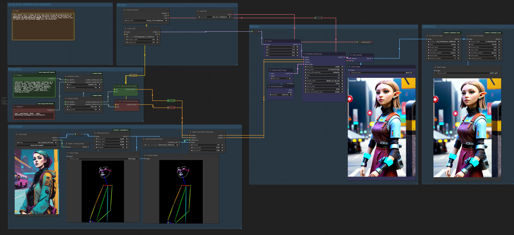
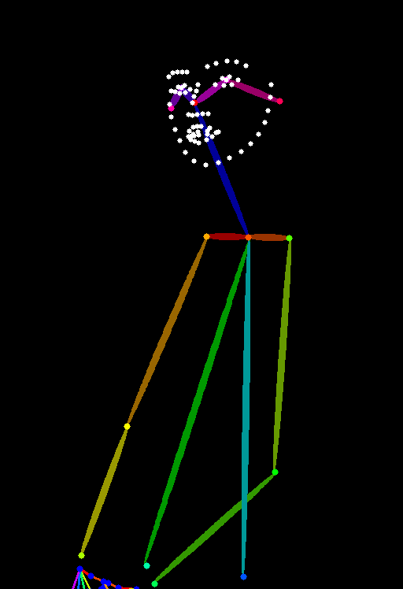

 <b> A collection of Controlnet based workflows 
 
<b> OPEN POSE work- note this model will work only for SDXL based models and not for SD 1.5 or other versions;

<b> Just drag and drop the images into your comfyUI workflow canvas to make this work !

 

 

 

An image of the openpose created using the preprocessor; 

 

Need to install the DW preprocesser from comfyUI controlnet Auxilliaries github;

<a href="https://github.com/Fannovel16/comfyui_controlnet_aux"> Fannovel16/comfyui_controlnet_aux </a>

A special thanks to Fannovel for his awesome work and examples. Please install all dependencies as required or mentioned in the repo.

All credit & copyright goes to https://github.com/lllyasviel.

<b> Installation:

Using ComfyUI Manager (recommended):

Install ComfyUI Manager and do steps introduced there to install the repo.

<b> MODEL NEEDS: 

Also will need the control net open pose model from huggingface repository for openposeXL2.safetensors for this to work.
The model links are as noted here;

<a href="https://huggingface.co/thibaud/controlnet-openpose-sdxl-1.0"> thibaud/controlnet-openpose-sdxl-1.0 </a>

<b> SDXL-controlnet: OpenPose (v2)

These are controlnet weights trained on stabilityai/stable-diffusion-xl-base-1.0 with OpenPose (v2) conditioning. 

